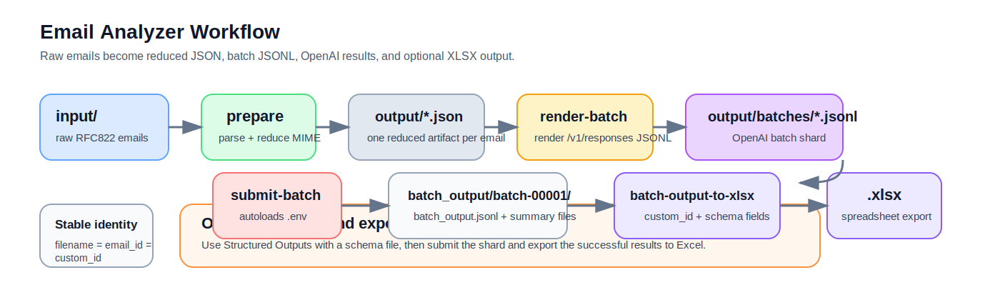

# Email Analyzer

`email_analyzer` is a local pipeline for turning raw RFC822 emails into smaller, auditable artifacts that are easier to send to an LLM.

It helps you:

1. parse noisy MIME emails into one reduced JSON artifact per message
2. render OpenAI Batch API JSONL from those reduced artifacts
3. optionally submit the batch to OpenAI or run it locally against Ollama
4. export structured batch results to `.xlsx`



The rendered batch shard can branch into either `submit-batch` for OpenAI or `submit-ollama-batch` for a local Ollama host.

## TL;DR Install

Requirements:

1. Python `3.13`
2. `uv`

Install the project and dev dependencies:

```bash
uv sync
uv run pytest
```

## TL;DR Configure Providers

If you want to use `submit-batch` or `submit-ollama-batch`, create a local `.env` file from the checked-in example:

```bash
cp .env.example .env
```

Fill in at least:

1. `OPENAI_API_KEY`
2. optionally `OPENAI_MODEL`
3. optionally `OLLAMA_BASE_URL`
4. optionally `OLLAMA_MODEL`

Notes:

1. `.env` is gitignored
2. the CLI auto-loads `.env` for every command
3. already-exported shell variables still win over `.env`
4. `render-batch` still expects `--model` explicitly today; `.env` is not used as a CLI default for that flag

## TL;DR Run On Your Own Emails

If you already have `.eml` files, put them under `input/` and run:

```bash
uv run python -m email_analyzer prepare \
  --input input \
  --output output \
  --logs logs \
  --workers 8

uv run python -m email_analyzer render-batch \
  --processed output \
  --batch-dir output/batches \
  --model gpt-5.4-nano \
  --instructions-file docs/prompt-example.txt \
  --schema-file docs/structured_output_schema_example.py
```

That gives you:

1. `output/<filename>.json`
2. `output/batches/batch-00001.jsonl`

If you want to stop at local preprocessing, you can stop there.

If you want to submit the batch to OpenAI and export the results to Excel:

```bash
uv run python -m email_analyzer submit-batch \
  --batch-jsonl output/batches/batch-00001.jsonl

uv run python -m email_analyzer batch-output-to-xlsx \
  --input-jsonl output/batch_output/batch-00001/batch_output.jsonl \
  --output-xlsx output/batch_output/batch-00001/batch_output.xlsx \
  --schema-file docs/structured_output_schema_example.py
```

If you want to run the same shard locally against Ollama instead:

```bash
uv run python -m email_analyzer submit-ollama-batch \
  --batch-jsonl output/batches/batch-00001.jsonl

uv run python -m email_analyzer batch-output-to-xlsx \
  --input-jsonl output/ollama_batch_output/batch-00001/batch_output.jsonl \
  --output-xlsx output/ollama_batch_output/batch-00001/batch_output.xlsx \
  --schema-file docs/structured_output_schema_example.py
```

By default, `submit-ollama-batch` reads:

1. `OLLAMA_BASE_URL`
2. `OLLAMA_MODEL`

The checked-in `.env.example` uses `OLLAMA_MODEL=gpt-oss:120b`.

## TL;DR SpamAssassin Test Drive

The repository already uses the Apache SpamAssassin public corpus as its main benchmark corpus.

Quickest end-to-end path:

```bash
mkdir -p benchmarks/spamassassin/downloads
mkdir -p benchmarks/spamassassin/extracted
mkdir -p benchmarks/spamassassin/input
mkdir -p benchmarks/spamassassin/runs

for archive in 20030228_easy_ham 20030228_easy_ham_2 20030228_hard_ham 20030228_spam 20030228_spam_2; do
  curl -L "https://spamassassin.apache.org/old/publiccorpus/${archive}.tar.bz2" \
    -o "benchmarks/spamassassin/downloads/${archive}.tar.bz2"
  tar -xjf "benchmarks/spamassassin/downloads/${archive}.tar.bz2" \
    -C "benchmarks/spamassassin/extracted"
done

for corpus in easy_ham easy_ham_2 hard_ham spam spam_2; do
  for file in "benchmarks/spamassassin/extracted/${corpus}"/*; do
    cp "$file" "benchmarks/spamassassin/input/${corpus}__$(basename "$file")"
  done
done

uv run python -m email_analyzer prepare \
  --input "benchmarks/spamassassin/input" \
  --output "benchmarks/spamassassin/runs/output_w8" \
  --logs "benchmarks/spamassassin/runs/logs_w8" \
  --workers 8

uv run python -m email_analyzer render-batch \
  --processed "benchmarks/spamassassin/runs/output_w8" \
  --batch-dir "benchmarks/spamassassin/runs/output_w8/batches" \
  --model gpt-5.4-nano \
  --instructions-file "docs/prompt-example.txt" \
  --schema-file "docs/structured_output_schema_example.py"

uv run python -m email_analyzer submit-batch \
  --batch-jsonl "benchmarks/spamassassin/runs/output_w8/batches/batch-00001.jsonl"

uv run python -m email_analyzer batch-output-to-xlsx \
  --input-jsonl "benchmarks/spamassassin/runs/output_w8/batch_output/batch-00001/batch_output.jsonl" \
  --output-xlsx "benchmarks/spamassassin/runs/output_w8/batch_output/batch-00001/batch_output.xlsx" \
  --schema-file "docs/structured_output_schema_example.py"
```

For a fuller benchmark walkthrough, historical timing notes, and other public corpora, see `docs/benchmarks.md`.

## Commands

Main commands:

1. `prepare`: reduce raw emails into one JSON artifact per email
2. `render-batch`: render OpenAI Batch API JSONL from processed artifacts
3. `submit-batch`: upload one rendered shard, poll it, and download output files
4. `submit-ollama-batch`: run one rendered shard locally against Ollama with rich progress output
5. `batch-output-to-xlsx`: convert successful structured batch results into `.xlsx`
6. `flatten-mailbox`: turn `mbox` or `mbox.gz` archives into one `.eml` file per message

## More Docs

Start here if you want more detail:

1. `docs/developer_guide.md`: pipeline design, contracts, logging, metrics, and implementation notes
2. `docs/benchmarks.md`: SpamAssassin setup, benchmark commands, and historical throughput notes
3. `docs/batch_submission.md`: batch submission behavior, output layout, and validation details
4. `docs/batch_state_machine.md`: OpenAI Batch lifecycle details

## What This Repository Assumes

The main assumptions stay fixed:

1. the input is raw RFC822 email
2. filenames are unique
3. the original filename is the stable identity everywhere
4. `email_id == source filename == OpenAI custom_id`

That identity rule is what lets the pipeline join local artifacts, batch submissions, and batch outputs without inventing extra IDs.
