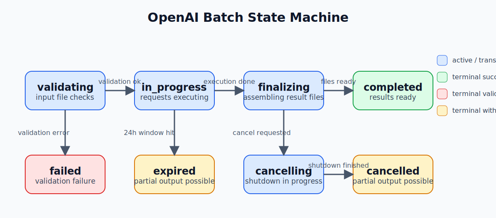

# Batch State Machine

OpenAI Batch objects move through a small documented state machine.

This repository records both the final batch object and the observed poll history so a run can be audited after completion.



## States

The documented batch states are:

1. `validating`
2. `failed`
3. `in_progress`
4. `finalizing`
5. `completed`
6. `expired`
7. `cancelling`
8. `cancelled`

## Practical Transitions

The main transition paths are:

```text
validating -> failed
validating -> in_progress
in_progress -> finalizing
in_progress -> expired
in_progress -> cancelling
finalizing -> completed
cancelling -> cancelled
```

## Meaning Of Each State

### `validating`

OpenAI is validating the uploaded JSONL before execution starts.

Typical reasons for ending here with failure:

1. malformed JSONL
2. invalid request body shape
3. unsupported endpoint or invalid parameters

### `failed`

The batch failed validation and never entered active processing.

The batch object may include an `errors` object with line-level diagnostics such as:

1. error code
2. line number
3. parameter name
4. human-readable message

### `in_progress`

The batch is actively running requests.

During this phase, `request_counts.completed` and `request_counts.failed` may increase over time.

### `finalizing`

OpenAI has finished request execution and is preparing batch result files.

### `completed`

The batch finished successfully enough for results to be ready.

This does not necessarily mean every request succeeded. Per-request failures can still exist and should be checked via:

1. `request_counts.failed`
2. `error_file_id`

### `expired`

The batch did not finish within the completion window.

Important behavior:

1. some requests may still have completed successfully
2. completed results may still be downloadable via `output_file_id`
3. unfinished requests are typically represented in the error file

### `cancelling`

The batch is in the process of cancellation.

### `cancelled`

The batch has finished cancelling.

As with `expired`, partial results may still exist if some requests completed before cancellation fully took effect.

## Relevant Batch Fields

The submitter uses these fields from the batch object:

1. `id`
2. `status`
3. `input_file_id`
4. `output_file_id`
5. `error_file_id`
6. `request_counts.total`
7. `request_counts.completed`
8. `request_counts.failed`
9. `errors`

Relevant timestamps:

1. `created_at`
2. `in_progress_at`
3. `finalizing_at`
4. `completed_at`
5. `failed_at`
6. `expires_at`
7. `expired_at`
8. `cancelling_at`
9. `cancelled_at`

## Derived Durations

`submit-batch` computes stage durations from the authoritative OpenAI timestamps when available.

Reported durations may include:

1. `validating`
2. `in_progress`
3. `finalizing`
4. `cancelling`
5. total elapsed time

The tool also records observed poll history in `batch_status_history.jsonl` so you can reconstruct the timeline seen by the client, not just the final API timestamps.

## Partial Results

Do not assume terminal states are all-or-nothing.

These states can still produce useful artifacts:

1. `completed`
2. `expired`
3. `cancelled`

The submitter therefore downloads:

1. `output_file_id` when present
2. `error_file_id` when present

This is true even if the terminal state is not a clean success.
